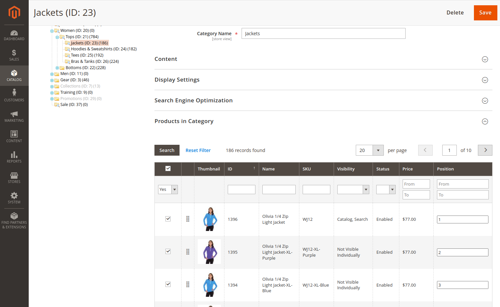

# Magento 2 Draggable Products on Category Edit Page 

 - [Main Functionalities](#markdown-header-main-functionalities)
 - [Installation](#markdown-header-installation)
 - [Configuration](#markdown-header-configuration)

## Main Functionalities

Module adds drag and drop option for products grid on category edit page for changing product's position in category. The module also extends the grid with a thumbnail column that simplifies choosing the optimal placement of products in the category. This modules supports Magento Community 2.3.x, Magento Community 2.4.x

    

## Installation

There are several possible options for installing module. 
### Type 1: Zip file

 - Unzip the zip file in `app/code/Wise/ProductPositionDraggable`
 - Enable the module by running `php bin/magento module:enable Wise_ProductPositionDraggable`
 - Apply database updates by running `php bin/magento setup:upgrade`\*
 - Generate module classes by running: `php bin/magento setup:di:compile`
 - Flush the cache by running `php bin/magento cache:flush`

### Type 2: Composer

 - Install the module composer by running `composer require wise/module-productpositiondraggable`
 - Enable the module by running `php bin/magento module:enable Wise_ProductPositionDraggable`
 - Apply database updates by running `php bin/magento setup:upgrade`\*
 - Generate module classes by running: `php bin/magento setup:di:compile`
 - Flush the cache by running `php bin/magento cache:flush`

## Configuration

This module doesn't require configuration. 

